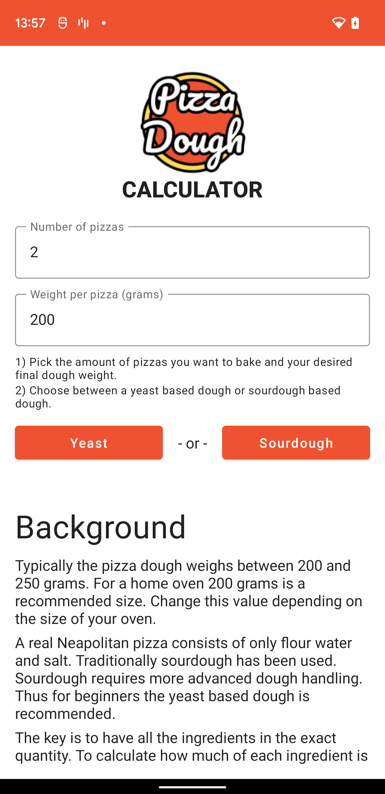
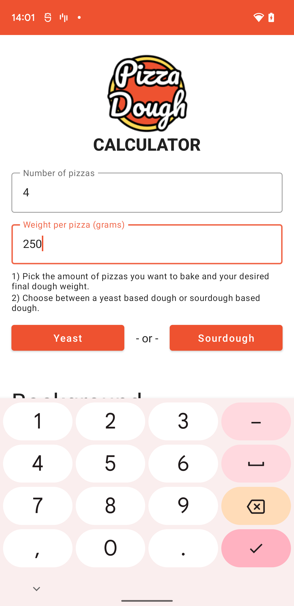
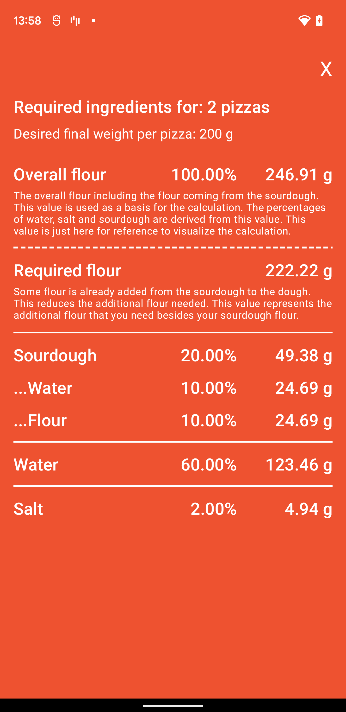

  
   
  

# Pizza Calculator App

Based on [The Bread Code Pizza Calculator](http://pizza-calculator.the-bread-code.io/) web app, this is just an Android App to help you to follow the recipe in the comfort of your kitchen.
You can find the original code [here](https://github.com/hendricius/pizza-dough).

This app is intended to be a pet project to try some things out like:

- Compose
- MVVM
- Coroutines
- Flows
- ...

So, the app will be updated/broken without prior notice, use it at your own risk!

## Screenshots

- Main screen
  
  
- Configuration screen
  

- Sourdough result screen
  
